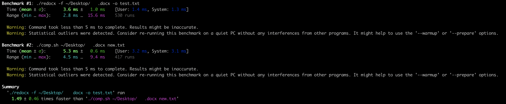
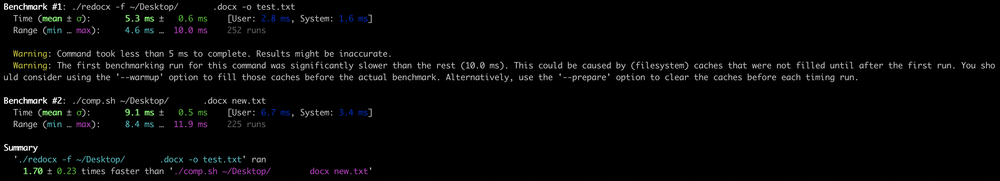
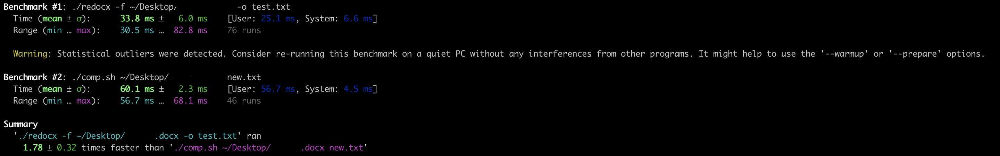

# redocx
A blazing-fast `.docx` decoder

## Usage
`redocx` is super simple to use! Just run:
```bash
$ redocx -f path/to/input/file.docx [-o path/to/optional/output/file.txt]
```
## Installation
There are two dependencies for `redocx`: `libzip` and `libxml2`. Both of these libraries must also be registered with pkg-config. How those two things are installed varies based on your system. For example:

* MacOS
```bash
brew install libxml2
brew install libzip
```

* Arch Linux
```bash
sudo pacman -S libxml2
sudo pacman -S libzip
```
Once those are installed, clone the repo, and move into the directory. Then follow the ritual:
```bash
./configure
make
sudo make install
```

## Inspiration
I have, like most developers, read the famous [webiquitte article](http://www.catb.org/esr/faqs/smart-questions.html). While reading it, I was thinking, "Surely someone out there has made a Word Document decoder for these hackers?! Why would they be annoyed, if they could just decode it?" So I got to searching. The best I was able to find was [this project](https://github.com/DecentM/undocx/blob/master/undocx) which, with all due respect to [the creator](https://github.com/DecentM), does not create neat or readable code. Newlines are not, for example, carried over. So, I set about to make my own.
## Benchmarks
`redocx` lives up to its description as a "blazing fast" decoder. For a small (~13kb) word document (Around one average length paragraph)... well, you can see the results yourself.

For a larger document, it takes slightly longer, but...

For a huge novel (115kb):

It's faster than anything else out there for decoding text from a `.docx` archive.
It may also be intiresting to note that I wrote a `rust` version of this program. However, it was abandoned because `redocx` performed 13.55 times (on average) better.
Thanks to [sharkdp](https://github.com/sharkdp) for the [utility](https://github.com/sharkdp/hyperfine) used in the benchmarking.
